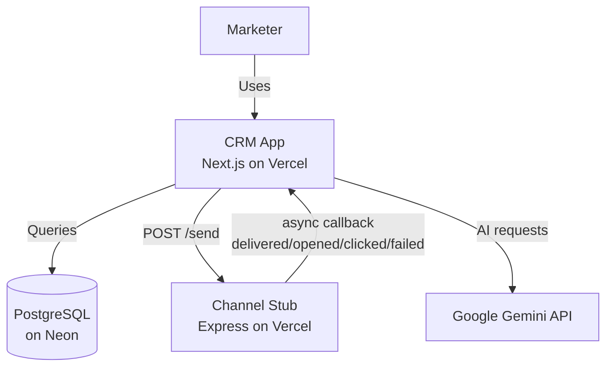

# Xeno Mini CRM

An AI-native Mini CRM for consumer brands to reach their shoppers with personalised campaigns.

Built for the Xeno Engineering Take-Home Assignment.

## Live Demo
🚀 **[xeno-mini-crm-eight.vercel.app](https://xeno-mini-crm-eight.vercel.app)**

## What it does
- **Ingest** customer and order data
- **Segment** shoppers by behaviour (spend, recency, tags, city)
- **AI Segment Builder** — describe your audience in plain English
- **Send campaigns** across Email, WhatsApp, SMS, RCS
- **AI Message Writer** — drafts personalised copy per segment
- **AI Co-pilot** — describe a goal, AI plans and creates the campaign
- **Analytics** — delivery, open, click, fail rates per campaign

## Architecture



Two services deployed independently:
- **CRM**: [xeno-mini-crm-eight.vercel.app](https://xeno-mini-crm-eight.vercel.app)
- **Channel Stub**: [xeno-channel-stub-theta.vercel.app](https://xeno-channel-stub-theta.vercel.app)

## Tech Stack
- **Frontend/Backend**: Next.js 16 (App Router) + TypeScript
- **Database**: PostgreSQL on Neon via Prisma 7
- **AI**: Google Gemini 2.5 Flash Lite
- **Styling**: Tailwind CSS
- **Deployment**: Vercel

## Key Design Decisions
- **Two-service architecture** mirrors real messaging providers (Twilio, Gupshup)
- **Async callback loop** simulates full delivery lifecycle
- **AI woven into core workflows** — not bolted on
- **Serverless-compatible** Prisma adapter for Neon

## Local Setup

```bash
# Clone the repo
git clone https://github.com/nisthajain12/xeno-mini-crm.git
cd xeno-mini-crm

# Install dependencies
pnpm install

# Set up environment variables
cp .env.example .env
# Add DATABASE_URL, GEMINI_API_KEY

# Push schema and seed data
npx prisma db push
npx prisma db seed

# Run the app
pnpm dev
```

Also run the channel stub:
```bash
git clone https://github.com/nisthajain12/xeno-channel-stub.git
cd xeno-channel-stub
pnpm install
pnpm dev
```
